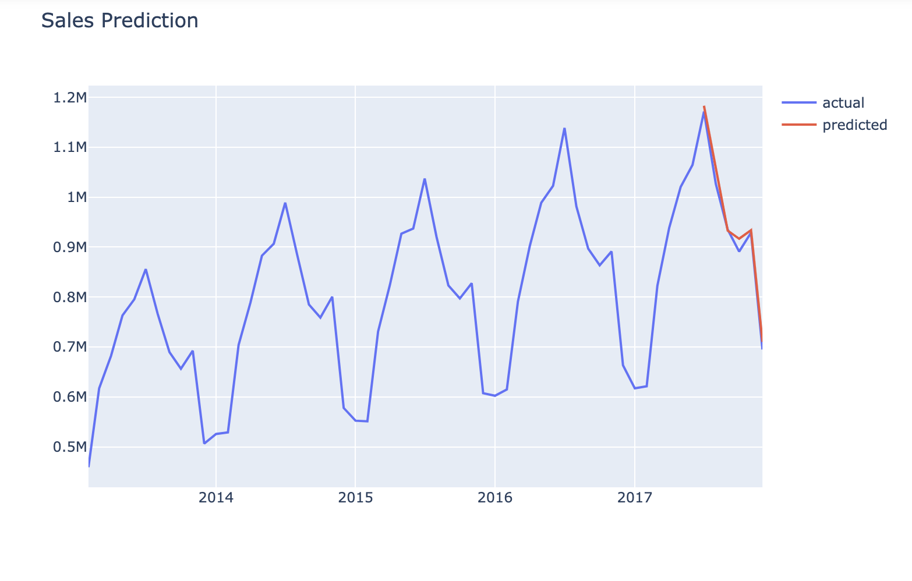

# Predict Monthly Sales (QTY) using Keras LSTM
---

## Executive Summary
---

### Problem Statment
Applying predictive approaches is a way to fuel a company's growth. 

**How does knowing future sales help our business?**
- It's a benchamrk
- It can be utilized for planning (we can plan our demand and supply actions by looking at forecasts)
- It's an excellent guide for planning budgets and targets

## Repository Information

Folders:
- `visuals`
- `datasets`

Notebooks:
- `01_PredictingSales`

Datasets:
- `train_n6.csv`: This dataset contains all purchases made for three different store locations. 
- https://www.kaggle.com/c/demand-forecasting-kernels-only/data
    - Columns
        - date: Date of the sale data. There are no holiday effects or store closures.
        - store: Store ID
        - item: Item ID
        - sales: Number of items sold at a particular store on a particular date.

---

## Repository Walkthrough 

This portion of the README will walkthrough my workflow of the project in chronological order. Please follow along!

### Notebook `01_PredictingSales` objective: Predict Sales for the next 6 months 
***This notebook uses `train_n6.csv`***

Here are the following tasks executed:
1. Data Wrangling 
    - Aggregate our data at the monthly level and sum up the sales column
2. Data transformation
    - Ensure the data is stationary
    - Converting from time series to supervised for having the feature set of our LSTM model
    - Diff(1)
    - Add 12 lags 
    - OLS to determine how many features to add
    - MixMaxScaler
3. Build the LSTM model and evaluate it!
    - Loss score of 0.0042
    - Created list of predictions
4. Inverse Transform to see the actual predictions
    - We calculated the standardized version of diff (1)
    - Our train set ends at June 
    - Test set starts in July 
    - Our first prediction is for July 1 (which equals to difference + last month sales) 
    - Note `result_dict['date'] = sales_dates[index+1]`
    - Validation Loss score (MSE) of 0.0116, RMSE of 29,665

---

# Conclusion Outline

We created a LSTM model that predicts future sales for the next 6 months. Here is a graph of our predictions: 

